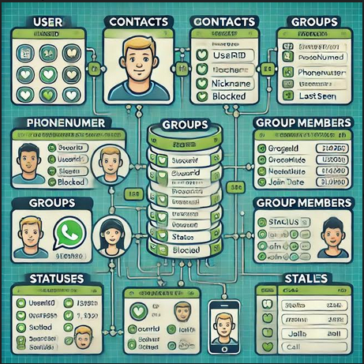

# WHATSAPP-DATABASE-DESIGN-

 
 

Once  User opened the Whatsapp he can able to see Contacts ,Status ,Calls ,and many features ..etc 
now our main theme of this project is
HOW THIS WHATSAPP DATA BASE IS CREATED AND HOW IT CAN BE RETRIEVED and any techniques can possible to use... 

 
The DESIGN is developed using NORMALIZATION technique, and STRUCTURED QUEREY LANGUAGE.

 

## ✨ Getting Started

- You should download those pdfs as given above.
- you can verify those sql createion queries and you can retrieve data
- make sure you have ORACLE database software.
 

## ⚡ Install

-  install  ORACLE database software in your computer 
-  use relations as given in pdf accordingly after Normalization 

 

## 📙 Used language
- Structured querey language (SQL)
- check whether you have created database before doing queries
  
 

 
Thank You ☺

